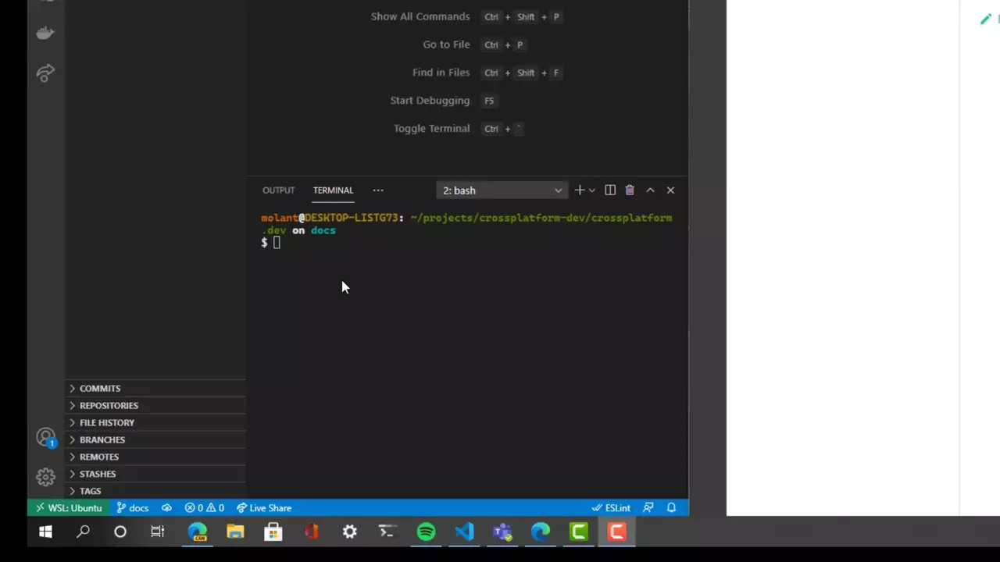

# Crossplatform.dev

[](https://app.netlify.com/sites/musing-turing-85b4c5/deploys)

This repository contains the code and contents of https://crossplatform.dev.

It is built using [Docusaurus 2](https://docusaurus.io/) and deployed on Netlify.

## Installation

To install it locally, you will need to:

* Install [Git] and [Node.js] installed on your machine
* Clone and install the dependencies of the project:

  ```console
  git clone https://github.com/crossplatform-dev/crossplatform.dev
  cd crossplatform.dev
  npm install
  ```

## Local Development

The project has the following folder structure:

```
crossplatform.dev
 |
 ├─ blog → Markdown files with the blogposts
 |
 ├─ docs → Markdown files with the contents of the documentation
 |
 ├─ scripts → JavaScript with the technology scaffolders and such
 |
 ├─ src → Docusaurus code
 |
 ├─ static → Docusaurus static assets
```

The following command will start a local development server and
open up a browser window:

```console
npm start
```

Most changes, like markdown modifications, `sidebars.js`, etc. are
reflected live without having to restart the server.

## Adding a new technology

To create a new technology overview, run the following command:

```console
npm run add-technology
```

You will be prompted the technology name and once provided:

* a new folder will be created under `/docs/` with its name
* the folder will have a few markdown files for you to complete
* `sidebars.js` will be updated to include the new technology
* a new file will be created under `/data/technologies/TECHNOLOGY.js`
  for you to complete



Additionally, there are a few markdown extensions that you
can use to interpolate and access the data under `/data/`
from markdown so it's easier to update the content.

### Interpolating data

The contents of `/data/` are accessible from markdown as a
JavaScript object that follows the same path structure and with the
contents of the json files loaded.

For example:

```
|- technologies
|   |- electron.json
|   |- ionic.json
```

Will return an object like:

```json
{
  "technologies": {
    "electron": { contents of electron.json},
    "ionic": { contents of ionic.json}
  }
}
```

You can access this data in a couple different ways;

#### Accessing a property

To print the value of a property you need to write something like:

```
{{ path.fileName.property1.property2 }}
```

Following the previous example, to access the property
`url` under `technologies/electron.json` the markup will be:

```
{{ technologies.electron.url }}
```

If you want to access a particular item on an array you can also
do it. The following will print the most recent version of Electron:

```
{{ technologies.electron.releases.0.version }}
```

#### Creating a table

The following are a series of examples of different ways to
create tables interpolating data:

##### Comparison table

To create a table that compares a property accross different
categories you use the following syntax:

```
{{ table folder.{}.property }}
```

For example, to generate a table that shows the platform support
of all the technologies the code is:

```
{{ table technologies.{}.platforms }}
```

##### Details table

To create a table for a property that is an object you can do this:

```
{{ table folder.filename.objectProperty.{} }}
```

For example, to list the platforms supported by Electron you have to
write the following:

```
{{ table technologies.electron.platforms.{} }}
```

##### List table

To create a table for a particular property that is an Array you
can do the following:

```
{{ table folder.filename.arrayProperty.[] }}
```

For example, the following will creata a list table with the latest
Electron releases.

```
{{ table technologies.electron.releases.[] }}
```

This assumes that `releases` is an Array of the same type of items
and it will generate a table using the property names of the 1st
object as the column names, adding a new line per item in the Array:

```
| Version | Date |
| --- | --- |
| vX.Y.Z | 2021/10/01 |
...
```

If you want to just list one of the properties you can do the following:

```
{{ table technologies.electron.releases.[].version }}
```

and the output will be:


```
| Version |
| --- |
| vX.Y.Z |
...
```


[git]: https://git-scm.com/downloads
[node.js]: https://nodejs.org/en/download/